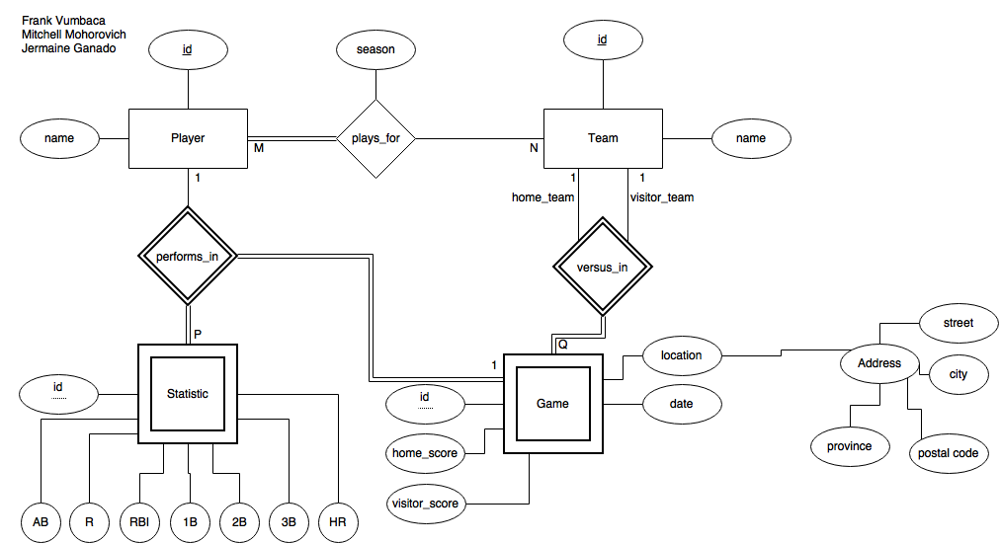
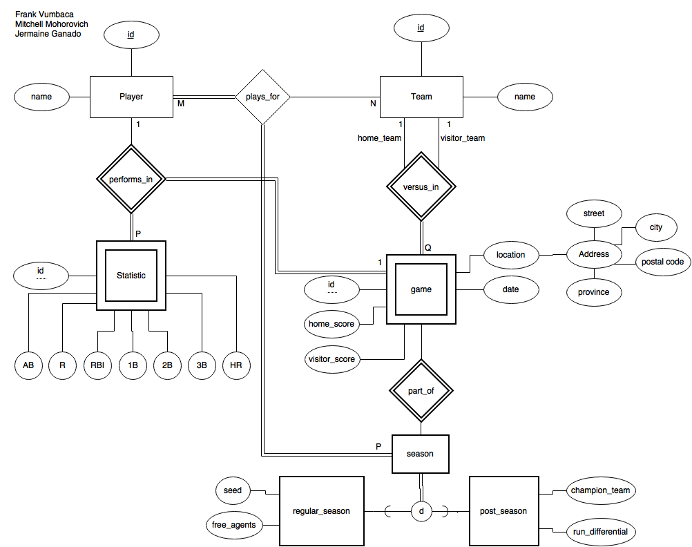
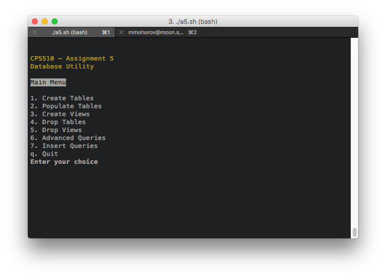
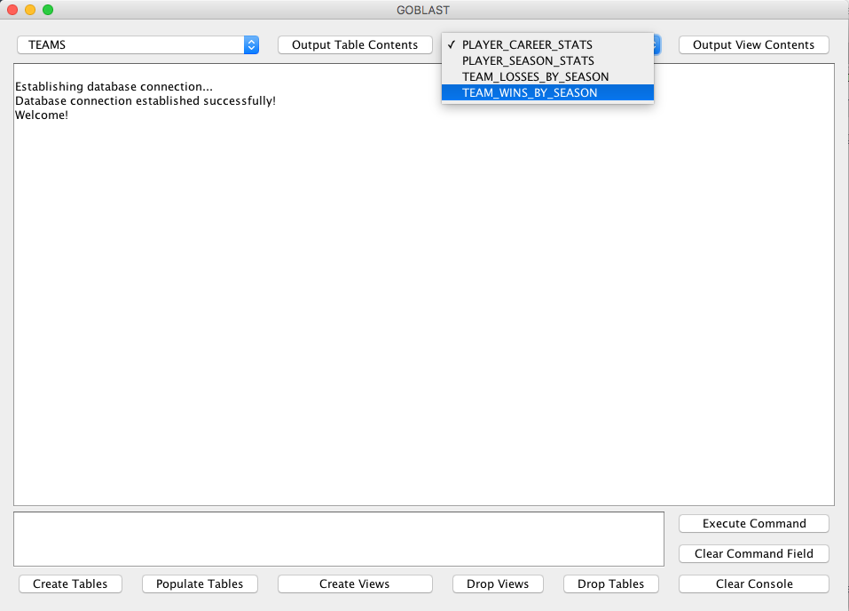

# CPS 510 - Final Assignment Report

Group Members:

- Jermaine Ganado, 500624506
- Mitchell Mohorovich, 500563037
- Frank Vumbaca, 500564107

## Phase 1: Logical Database Design

### 1. Application Selection

The application chosen for this project was a houseleague/casual baseball/softball league management and statistics tracker. There are many companies and groups that run their own casual leagues and often the planning and statistics gathering is all done by hand or using other crude methods. 

This application would allow users to be able to create teams and players to organize game seasons, as well as track the statistics of the games within those seasons.

### 2. ER Model

The initial ER model is displayed below:



This ER diagram covered majority of the database design, but additional information was added in the next design phase in the EER diagram.


### 3. Schema Design

The EER model is displayed below:



This shows the addition of the `Season` entity, and using aggregation, it shows there are different types of seasons: `regular` and `post` (playoffs) shown through disjoint specialization.

From this EER diagram, the schema of the database was created, and the first version of schema was developed. The table generation is shown below:

```sql
-- team table generation
CREATE TABLE MMOHOROV.TEAMS
(
  id INT PRIMARY KEY NOT NULL,
  name VARCHAR(25)
);


-- player table generation
CREATE TABLE MMOHOROV.PLAYERS
(
  id INT PRIMARY KEY NOT NULL,
  first_name VARCHAR(25),
  last_name VARCHAR(25)
);


-- season table generation
CREATE TABLE MMOHOROV.SEASONS
(
  id INT PRIMARY KEY,
  year INT NOT NULL,
  type VARCHAR(10) NOT NULL
);


-- plays_for table generation
CREATE TABLE MMOHOROV.PLAYS_FOR
(
  PLAYER_ID INT,
  SEASON_ID INT,
  TEAM_ID INT,
  CONSTRAINT PLAY PRIMARY KEY (PLAYER_ID, TEAM_ID, SEASON_ID),
  CONSTRAINT PLAYER_ID FOREIGN KEY (PLAYER_ID) REFERENCES PLAYERS (ID),
  CONSTRAINT SEASON_ID FOREIGN KEY (SEASON_ID) REFERENCES SEASONS (ID),
  CONSTRAINT TEAM_ID FOREIGN KEY (TEAM_ID) REFERENCES TEAMS (ID)
);


CREATE TABLE MMOHOROV.GAMES
(
  ID INT PRIMARY KEY NOT NULL,
  HOME_TEAM_ID INT NOT NULL,
  VISITOR_TEAM_ID INT NOT NULL,
  SEASON_ID INT NOT NULL,
  HOME_SCORE INT NOT NULL,
  VISITOR_SCORE INT NOT NULL,
  GAME_LOCATION VARCHAR2(50) NOT NULL,
  GAME_DATE TIMESTAMP NOT NULL,
  CONSTRAINT HOME_TEAM_ID FOREIGN KEY (HOME_TEAM_ID) REFERENCES TEAMS (ID),
  CONSTRAINT VISITOR_TEAM_ID FOREIGN KEY (VISITOR_TEAM_ID) REFERENCES TEAMS (ID),
  CONSTRAINT SEASON_ID FOREIGN KEY (SEASON_ID) REFERENCES SEASONS (ID)
);


-- creating STATISTICS table code
CREATE TABLE MMOHOROV.STATISTICS
(
  PLAYER_ID INT NOT NULL,
  GAME_ID INT NOT NULL,
  AB INT NOT NULL,
  R INT NOT NULL,
  RBI INT NOT NULL,
  "1B" INT NOT NULL,
  "2B" INT NOT NULL,
  "3B" INT NOT NULL,
  HR INT NOT NULL,
  CONSTRAINT STATISTICS_ID PRIMARY KEY (PLAYER_ID, GAME_ID),
  CONSTRAINT PLAYER_ID FOREIGN KEY (PLAYER_ID) REFERENCES PLAYERS (ID),
  CONSTRAINT GAME_ID FOREIGN KEY (GAME_ID) REFERENCES GAMES (ID)
);
```

## Phase 2: Implementation

### 4. Designing Views/Simple Queries

After the schema was designed based on the EER diagram, simple queries were designed to basic functionality of the schema, and views were also designed.

The resulting SQL and results for thev views are shown below:

#### Simple Queries SQL

```sql

SELECT * FROM GAMES WHERE GAMES.VISITOR_SCORE = GAMES.HOME_SCORE;

SELECT * FROM GAMES WHERE GAMES.VISITOR_SCORE > GAMES.HOME_SCORE;

SELECT * FROM GAMES WHERE GAMES.VISITOR_SCORE < GAMES.HOME_SCORE;

SELECT * FROM PLAYERS WHERE PLAYERS.FIRST_NAME = 'Regina';

SELECT * FROM SEASONS WHERE SEASONS.YEAR < 2016;

SELECT * FROM SEASONS WHERE SEASONS.YEAR = 2016;

SELECT * FROM PLAYS_FOR WHERE PLAYS_FOR.TEAM_ID = 1;

SELECT * FROM STATISTICS WHERE STATISTICS.HR > 0;

SELECT * FROM TEAMS WHERE TEAMS.NAME = 'The Mathletes';
```

#### Relational Algebra

σ<sub>visitor_score = home_score</sub> (Games)

σ<sub>visitor_score > home_score</sub> (Games)

σ<sub>visitor_score < home_score</sub> (Games)

σ<sub>first_name = 'Regina'</sub> (Players)

σ<sub>year < 2016</sub> (Seasons)

σ<sub>year = 2016</sub> (Seasons)

σ<sub>team_id = 1</sub> (Plays_for)

σ<sub>statistics.hr > 0 </sub> (Statistics)

σ<sub>name = 'The Mathletes'</sub> (Teams)

The following SQL queries below contain the view generation code for assignment 4.

#### View 1

View 1 creates a view that shows the statistics for every player for every season.

##### SQL View Creation Code

```sql
CREATE VIEW PLAYER_SEASON_STATS (
    PLAYER_ID,
    SEASON_ID,
    PLAYER_FNAME,
    PLAYER_LNAME,
    AB_AVG, R_AVG,
    RBI_AVG,
    "1B_AVG",
    "2B_AVG",
    "3B_AVG",
    "HR_AVG",
    H,
    BA)
AS
  SELECT
    s.PLAYER_ID,
    SEASONS.ID,
    PLAYERS.FIRST_NAME,
    PLAYERS.LAST_NAME,
    avg(s.AB),
    avg(s.R),
    avg(s.RBI),
    avg(s."1B"),
    avg(s."2B"),
    avg(s."3B"),
    avg(s.HR),
    sum(s."1B") + sum(s."2B") + sum(s."3B") + sum(s.HR),
    (sum(s."1B") + sum(s."2B") + sum(s."3B") + sum(s.HR) ) / sum(s.AB)
  FROM STATISTICS s
    INNER JOIN GAMES
      ON s.GAME_ID = GAMES.ID
    INNER JOIN SEASONS
      ON SEASONS.ID = GAMES.SEASON_ID
    RIGHT OUTER JOIN PLAYERS
      ON s.PLAYER_ID = PLAYERS.ID
  GROUP BY s.PLAYER_ID, SEASONS.ID, PLAYERS.FIRST_NAME, PLAYERS.LAST_NAME
  ORDER BY s.PLAYER_ID, SEASONS.ID
 WITH READ ONLY;
``` 

##### SQL Query Code

```sql

SELECT
  PLAYER_ID AS "Player ID",
  PLAYER_FNAME AS "First Name",
  PLAYER_LNAME AS "Last Name",
  SEASON_ID AS "Season ID",
  TRUNC(AB_AVG, 1) AS "Season AB",
  TRUNC(R_AVG, 1) AS "Season R",
  TRUNC(RBI_AVG, 1) AS "Season RBI",
  TRUNC("1B_AVG", 1) AS "Season 1B",
  TRUNC("2B_AVG", 1) AS "Season 2B",
  TRUNC("3B_AVG", 1) AS "Season 3B",
  TRUNC(HR_AVG, 1) AS "Season HR",
  TRUNC(H, 1) AS "Season Hits",
  TRUNC(BA, 1) AS "Season Batting Average"
FROM PLAYER_SEASON_STATS;
```

##### Result
<table border="1" style="border-collapse:collapse">
<tr><th>Player ID</th><th>First Name</th><th>Last Name</th><th>Season ID</th><th>Season AB</th><th>Season R</th><th>Season RBI</th><th>Season 1B</th><th>Season 2B</th><th>Season 3B</th><th>Season HR</th><th>Season Hits</th><th>Season Batting Average</th></tr>
<tr><td>0</td><td>Cady</td><td>Heron</td><td>1</td><td>7</td><td>0.7</td><td>0.7</td><td>0</td><td>0</td><td>0.2</td><td>0.5</td><td>3</td><td>0.1</td></tr>
<tr><td>0</td><td>Cady</td><td>Heron</td><td>2</td><td>5</td><td>0.2</td><td>0.7</td><td>0</td><td>0</td><td>0</td><td>0.2</td><td>1</td><td>0</td></tr>
<tr><td>1</td><td>Regina</td><td>George</td><td>1</td><td>7</td><td>0.5</td><td>0.7</td><td>0</td><td>0</td><td>0.2</td><td>0.2</td><td>2</td><td>0</td></tr>
<tr><td>1</td><td>Regina</td><td>George</td><td>2</td><td>5</td><td>0</td><td>0</td><td>0</td><td>0</td><td>0</td><td>0</td><td>0</td><td>0</td></tr>
<tr><td>2</td><td>Gretchen</td><td>Wieners</td><td>1</td><td>7</td><td>0.2</td><td>0</td><td>0.2</td><td>0.2</td><td>0</td><td>0</td><td>2</td><td>0</td></tr>
<tr><td>2</td><td>Gretchen</td><td>Wieners</td><td>2</td><td>5</td><td>0.2</td><td>0.2</td><td>0</td><td>0.2</td><td>0</td><td>0.2</td><td>2</td><td>0.1</td></tr>
<tr><td>3</td><td>Janis</td><td>Ian</td><td>1</td><td>7</td><td>0.5</td><td>0.2</td><td>0</td><td>0</td><td>0.2</td><td>0</td><td>1</td><td>0</td></tr>
<tr><td>3</td><td>Janis</td><td>Ian</td><td>2</td><td>5</td><td>0.2</td><td>0.2</td><td>0.2</td><td>0</td><td>0</td><td>0</td><td>1</td><td>0</td></tr>
<tr><td>4</td><td>Karen</td><td>Smith</td><td>1</td><td>6</td><td>0.5</td><td>0</td><td>0.5</td><td>0.5</td><td>0</td><td>0.2</td><td>5</td><td>0.2</td></tr>
<tr><td>4</td><td>Karen</td><td>Smith</td><td>2</td><td>5</td><td>0.5</td><td>0.5</td><td>0.2</td><td>0.2</td><td>0</td><td>0</td><td>2</td><td>0.1</td></tr>
<tr><td>5</td><td>Kevin</td><td>Gnapoor</td><td>1</td><td>6</td><td>0.2</td><td>0.5</td><td>0.5</td><td>0</td><td>0</td><td>0.2</td><td>3</td><td>0.1</td></tr>
<tr><td>5</td><td>Kevin</td><td>Gnapoor</td><td>2</td><td>5</td><td>0.5</td><td>0.5</td><td>0.2</td><td>0.5</td><td>0</td><td>0</td><td>3</td><td>0.1</td></tr>
<tr><td>6</td><td>Trang</td><td>Pak</td><td>1</td><td>6</td><td>0</td><td>0.7</td><td>0.2</td><td>0</td><td>0</td><td>0</td><td>1</td><td>0</td></tr>
<tr><td>6</td><td>Trang</td><td>Pak</td><td>2</td><td>5</td><td>0.5</td><td>0.2</td><td>0.5</td><td>0</td><td>0.2</td><td>0</td><td>3</td><td>0.1</td></tr>
<tr><td>7</td><td>Aaron</td><td>Samuels</td><td>1</td><td>6</td><td>0.2</td><td>0.5</td><td>0.2</td><td>0</td><td>0</td><td>0</td><td>1</td><td>0</td></tr>
<tr><td>7</td><td>Aaron</td><td>Samuels</td><td>2</td><td>5</td><td>0.2</td><td>0</td><td>0</td><td>0</td><td>0</td><td>0.2</td><td>1</td><td>0</td></tr>
<tr><td>8</td><td>Glenn</td><td>Cocoo</td><td>1</td><td>6</td><td>0</td><td>0</td><td>0</td><td>0.2</td><td>0</td><td>0</td><td>1</td><td>0</td></tr>
<tr><td>8</td><td>Glenn</td><td>Cocoo</td><td>2</td><td>5</td><td>0.2</td><td>0.5</td><td>0</td><td>0.2</td><td>0.2</td><td>0</td><td>2</td><td>0.1</td></tr>
<tr><td>9</td><td>Shane</td><td>Oman</td><td>1</td><td>6</td><td>0</td><td>0</td><td>0.2</td><td>0</td><td>0</td><td>0</td><td>1</td><td>0</td></tr>
<tr><td>9</td><td>Shane</td><td>Oman</td><td>2</td><td>5</td><td>0.5</td><td>0.2</td><td>0.2</td><td>0</td><td>0</td><td>0.2</td><td>2</td><td>0.1</td></tr>
<tr><td>10</td><td>Ms.</td><td>Norbury</td><td>1</td><td>7</td><td>0.2</td><td>0.2</td><td>0</td><td>0.2</td><td>0</td><td>0</td><td>1</td><td>0</td></tr>
<tr><td>10</td><td>Ms.</td><td>Norbury</td><td>2</td><td>5</td><td>0.5</td><td>0.2</td><td>0.5</td><td>0.2</td><td>0</td><td>0</td><td>3</td><td>0.1</td></tr>
<tr><td>11</td><td>Mrs.</td><td>George</td><td>1</td><td>7</td><td>0.2</td><td>0.7</td><td>0</td><td>0.2</td><td>0</td><td>0.2</td><td>2</td><td>0</td></tr>
<tr><td>11</td><td>Mrs.</td><td>George</td><td>2</td><td>5</td><td>0.2</td><td>0.5</td><td>0.2</td><td>0</td><td>0.5</td><td>0</td><td>3</td><td>0.1</td></tr>
<tr><td>12</td><td>Caroline</td><td>Krafft</td><td>1</td><td>6</td><td>0.2</td><td>0</td><td>0</td><td>0.2</td><td>0</td><td>0</td><td>1</td><td>0</td></tr>
<tr><td>12</td><td>Caroline</td><td>Krafft</td><td>2</td><td>5</td><td>0.5</td><td>0.2</td><td>0</td><td>0.2</td><td>0.2</td><td>0</td><td>2</td><td>0.1</td></tr>
<tr><td>13</td><td>Coach</td><td>Carr</td><td>1</td><td>6</td><td>0</td><td>0</td><td>0.2</td><td>0</td><td>0</td><td>0</td><td>1</td><td>0</td></tr>
<tr><td>13</td><td>Coach</td><td>Carr</td><td>2</td><td>5</td><td>0.2</td><td>0.7</td><td>0</td><td>0</td><td>0.2</td><td>0.2</td><td>2</td><td>0.1</td></tr>
<tr><td>14</td><td>Principal</td><td>Duvall</td><td>1</td><td>6</td><td>0.5</td><td>0.2</td><td>0</td><td>0</td><td>0.2</td><td>0.2</td><td>2</td><td>0</td></tr>
<tr><td>14</td><td>Principal</td><td>Duvall</td><td>2</td><td>5</td><td>0</td><td>0</td><td>0</td><td>0</td><td>0</td><td>0</td><td>0</td><td>0</td></tr>
<tr><td>15</td><td>Emma</td><td>Gerber</td><td>1</td><td>6</td><td>0</td><td>0</td><td>0</td><td>0</td><td>0</td><td>0</td><td>0</td><td>0</td></tr>
<tr><td>15</td><td>Emma</td><td>Gerber</td><td>2</td><td>5</td><td>0.5</td><td>0</td><td>0</td><td>0.2</td><td>0</td><td>0</td><td>1</td><td>0</td></tr>
<tr><td>16</td><td>Taylor</td><td>Wedell</td><td>1</td><td>6</td><td>0.2</td><td>0</td><td>0.2</td><td>0</td><td>0</td><td>0</td><td>1</td><td>0</td></tr>
<tr><td>17</td><td>Kristen</td><td>Hadley</td><td>1</td><td>6</td><td>0.5</td><td>0.5</td><td>0.5</td><td>0</td><td>0</td><td>0</td><td>2</td><td>0</td></tr>
<tr><td>17</td><td>Kristen</td><td>Hadley</td><td>2</td><td>5</td><td>0.5</td><td>0.2</td><td>0.5</td><td>0</td><td>0</td><td>0</td><td>2</td><td>0.1</td></tr>
<tr><td>18</td><td>Dawn</td><td>Schweitzer</td><td>1</td><td>6</td><td>0</td><td>0</td><td>0.2</td><td>0</td><td>0</td><td>0</td><td>1</td><td>0</td></tr>
<tr><td>18</td><td>Dawn</td><td>Schweitzer</td><td>2</td><td>5</td><td>0.5</td><td>0.2</td><td>0.2</td><td>0</td><td>0.2</td><td>0</td><td>2</td><td>0.1</td></tr>
<tr><td>19</td><td>Tim</td><td>Pak</td><td>1</td><td>6</td><td>0.2</td><td>0.2</td><td>0</td><td>0</td><td>0</td><td>0</td><td>0</td><td>0</td></tr>
<tr><td>19</td><td>Tim</td><td>Pak</td><td>2</td><td>5</td><td>0.2</td><td>0.5</td><td>0</td><td>0.2</td><td>0</td><td>0</td><td>1</td><td>0</td></tr>
<tr><td>20</td><td>Damian</td><td>Leigh</td><td>2</td><td>5</td><td>0.5</td><td>0.2</td><td>0.2</td><td>0</td><td>0</td><td>0</td><td>1</td><td>0</td></tr></table>

#### View 2

This view shows the career statistics of every player in the database.

##### SQL Creation Code

```sql
CREATE VIEW PLAYER_CAREER_STATS (
    PLAYER_ID,
    PLAYER_FNAME,
    PLAYER_LNAME,
    AB_CAREER,
    R_CAREER,
    RBI_CAREER,
    "1B_CAREER",
    "2B_CAREER",
    "3B_CAREER",
    "HR_CAREER",
    "H_CAREER",
    "BA_CAREER"
) AS
  SELECT
    PLAYER_ID,
    PLAYER_FNAME,
    PLAYER_LNAME,
    avg(AB_AVG),
    avg(R_AVG),
    avg(RBI_AVG),
    avg("1B_AVG"),
    avg("2B_AVG"),
    avg("3B_AVG"),
    avg(HR_AVG),
    avg(H),
    avg(BA)
  FROM PLAYER_SEASON_STATS
  GROUP BY PLAYER_ID, PLAYER_FNAME, PLAYER_LNAME
  ORDER BY PLAYER_LNAME, PLAYER_FNAME, PLAYER_ID;
```

##### SQL Query Code
```sql
SELECT
  PLAYER_ID AS "Player ID",
  PLAYER_FNAME AS "First Name",
  PLAYER_LNAME AS "Last Name",
  TRUNC(AB_CAREER, 1) AS "Career AB",
  TRUNC(R_CAREER, 1) AS "Career R",
  TRUNC(RBI_CAREER, 1) AS "Career RBI",
  TRUNC("1B_CAREER", 1) AS "Career 1B",
  TRUNC("2B_CAREER", 1) AS "Career 2B",
  TRUNC("3B_CAREER", 1) AS "Career 3B",
  TRUNC(HR_CAREER, 1) AS "Career HR",
  TRUNC(H_CAREER, 1) AS "Career Hits",
  TRUNC(BA_CAREER, 1) AS "Career Batting Average"
FROM PLAYER_CAREER_STATS;
```

##### Result

<table border="1" style="border-collapse:collapse">
<tr><th>Player ID</th><th>First Name</th><th>Last Name</th><th>Career AB</th><th>Career R</th><th>Career RBI</th><th>Career 1B</th><th>Career 2B</th><th>Career 3B</th><th>Career HR</th><th>Career Hits</th><th>Career Batting Average</th></tr>
<tr><td>13</td><td>Coach</td><td>Carr</td><td>5.5</td><td>0.1</td><td>0.3</td><td>0.1</td><td>0</td><td>0.1</td><td>0.1</td><td>1.5</td><td>0</td></tr>
<tr><td>8</td><td>Glenn</td><td>Cocoo</td><td>5.5</td><td>0.1</td><td>0.2</td><td>0</td><td>0.2</td><td>0.1</td><td>0</td><td>1.5</td><td>0</td></tr>
<tr><td>14</td><td>Principal</td><td>Duvall</td><td>5.5</td><td>0.2</td><td>0.1</td><td>0</td><td>0</td><td>0.1</td><td>0.1</td><td>1</td><td>0</td></tr>
<tr><td>11</td><td>Mrs.</td><td>George</td><td>6</td><td>0.2</td><td>0.6</td><td>0.1</td><td>0.1</td><td>0.2</td><td>0.1</td><td>2.5</td><td>0.1</td></tr>
<tr><td>1</td><td>Regina</td><td>George</td><td>6</td><td>0.2</td><td>0.3</td><td>0</td><td>0</td><td>0.1</td><td>0.1</td><td>1</td><td>0</td></tr>
<tr><td>15</td><td>Emma</td><td>Gerber</td><td>5.5</td><td>0.2</td><td>0</td><td>0</td><td>0.1</td><td>0</td><td>0</td><td>0.5</td><td>0</td></tr>
<tr><td>5</td><td>Kevin</td><td>Gnapoor</td><td>5.5</td><td>0.3</td><td>0.5</td><td>0.3</td><td>0.2</td><td>0</td><td>0.1</td><td>3</td><td>0.1</td></tr>
<tr><td>17</td><td>Kristen</td><td>Hadley</td><td>5.5</td><td>0.5</td><td>0.3</td><td>0.5</td><td>0</td><td>0</td><td>0</td><td>2</td><td>0</td></tr>
<tr><td>0</td><td>Cady</td><td>Heron</td><td>6</td><td>0.5</td><td>0.7</td><td>0</td><td>0</td><td>0.1</td><td>0.3</td><td>2</td><td>0</td></tr>
<tr><td>3</td><td>Janis</td><td>Ian</td><td>6</td><td>0.3</td><td>0.2</td><td>0.1</td><td>0</td><td>0.1</td><td>0</td><td>1</td><td>0</td></tr>
<tr><td>12</td><td>Caroline</td><td>Krafft</td><td>5.5</td><td>0.3</td><td>0.1</td><td>0</td><td>0.2</td><td>0.1</td><td>0</td><td>1.5</td><td>0</td></tr>
<tr><td>20</td><td>Damian</td><td>Leigh</td><td>5</td><td>0.5</td><td>0.2</td><td>0.2</td><td>0</td><td>0</td><td>0</td><td>1</td><td>0</td></tr>
<tr><td>10</td><td>Ms.</td><td>Norbury</td><td>6</td><td>0.3</td><td>0.2</td><td>0.2</td><td>0.2</td><td>0</td><td>0</td><td>2</td><td>0</td></tr>
<tr><td>9</td><td>Shane</td><td>Oman</td><td>5.5</td><td>0.2</td><td>0.1</td><td>0.2</td><td>0</td><td>0</td><td>0.1</td><td>1.5</td><td>0</td></tr>
<tr><td>19</td><td>Tim</td><td>Pak</td><td>5.5</td><td>0.2</td><td>0.3</td><td>0</td><td>0.1</td><td>0</td><td>0</td><td>0.5</td><td>0</td></tr>
<tr><td>6</td><td>Trang</td><td>Pak</td><td>5.5</td><td>0.2</td><td>0.5</td><td>0.3</td><td>0</td><td>0.1</td><td>0</td><td>2</td><td>0</td></tr>
<tr><td>7</td><td>Aaron</td><td>Samuels</td><td>5.5</td><td>0.2</td><td>0.2</td><td>0.1</td><td>0</td><td>0</td><td>0.1</td><td>1</td><td>0</td></tr>
<tr><td>18</td><td>Dawn</td><td>Schweitzer</td><td>5.5</td><td>0.2</td><td>0.1</td><td>0.2</td><td>0</td><td>0.1</td><td>0</td><td>1.5</td><td>0</td></tr>
<tr><td>4</td><td>Karen</td><td>Smith</td><td>5.5</td><td>0.5</td><td>0.2</td><td>0.3</td><td>0.3</td><td>0</td><td>0.1</td><td>3.5</td><td>0.1</td></tr>
<tr><td>16</td><td>Taylor</td><td>Wedell</td><td>6</td><td>0.2</td><td>0</td><td>0.2</td><td>0</td><td>0</td><td>0</td><td>1</td><td>0</td></tr>
<tr><td>2</td><td>Gretchen</td><td>Wieners</td><td>6</td><td>0.2</td><td>0.1</td><td>0.1</td><td>0.2</td><td>0</td><td>0.1</td><td>2</td><td>0</td></tr></table>

#### 5. Advanced Queries and Unix Shell Implementation

For this phase of the project, a shell script was written to allow for easy schema creation population and querying. A screenshot of the interface is attached below:



Those queries are shown below with their respective results.

#### Query 1

This query uses two sub queries unioned to compute the total runs each team had for each season. Two subqueries were used to extract the runs when the team is away and when the team is home. The two values are then summed to find the total for each team for each seasons.

##### SQL Query
```sql
SELECT
  SEASON_ID,
  TEAM_ID,
  TEAMS.NAME AS "Team Name",
  SEASONS.YEAR AS "Season Year",
  SEASONS.TYPE AS "Season Type",
  sum(SCORE_SUM) AS "Team Runs Per Season"
FROM (
  SELECT
    SEASON_ID,
    HOME_TEAM_ID AS TEAM_ID,
    sum(HOME_SCORE) AS SCORE_SUM
  FROM GAMES
  GROUP BY SEASON_ID, HOME_TEAM_ID
  UNION
  SELECT
    SEASON_ID,
    VISITOR_TEAM_ID,
    sum(VISITOR_SCORE) AS VISITOR_SCORE_SUM
  FROM GAMES
  GROUP BY SEASON_ID, VISITOR_TEAM_ID
  )
  JOIN TEAMS ON TEAM_ID = TEAMS.ID
  JOIN SEASONS ON SEASON_ID = SEASONS.ID
GROUP BY SEASON_ID, TEAM_ID, TEAMS.NAME, SEASONS.YEAR, Seasons.TYPE
ORDER BY SEASON_ID ASC, TEAM_ID ASC;
```

##### Relational Algebra

home ← π<sub>season\_id, home\_team\_id, SUM home\_score</sub> (Games)

visitor ← π<sub>season\_id, visitor\_team\_id, SUM visitor\_score</sub> (Games)

union ← home ∪ visitor

team\_join ← union ⋈<sub>home\_team\_id = id</sub> teams 

seasons\_join ← team\_join ⋈<sub>season\_id = id</sub> seasons

π<sub>season\_id, team\_id, teams.name, seasons.year, seasons.type, SUM score\_sum</sub> (seasons\_join)

##### Result
<table border="1" style="border-collapse:collapse">
<tr><th>SEASON_ID</th><th>TEAM_ID</th><th>Team Name</th><th>Season Year</th><th>Season Type</th><th>Team Runs Per Season</th></tr>
<tr><td>1</td><td>1</td><td>The Plastics</td><td>2015</td><td>regular</td><td>12</td></tr>
<tr><td>1</td><td>2</td><td>The Mathletes</td><td>2015</td><td>regular</td><td>13</td></tr>
<tr><td>2</td><td>1</td><td>The Plastics</td><td>2016</td><td>regular</td><td>13</td></tr>
<tr><td>2</td><td>2</td><td>The Mathletes</td><td>2016</td><td>regular</td><td>14</td></tr></table>


#### Query 2

This query uses one subquery pulling every player’s season’s performance data. The performance data is then partitioned by season, and ordered by their batting average. The players with the top 5 batting averages are selected with the where clause and finally ordered by season then ranking. The result is a table showing the top five players for every season.

##### SQL Query


```sql
SELECT
  RN AS "Season Ranking",
  PLAYER_FNAME AS "Player First Name",
  PLAYER_LNAME AS "Player Last Name",
  SEASON_ID AS "Season ID",
  SEASONS.YEAR AS "Season Year",
  SEASONS.TYPE AS "Season Type",
  TRUNC(BA, 3) AS "Batting Average"
FROM
  (
    SELECT PLAYER_ID, PLAYER_FNAME, PLAYER_LNAME, SEASON_ID, BA,
      ROW_NUMBER() OVER (PARTITION BY SEASON_ID ORDER BY BA DESC) RN
    FROM   PLAYER_SEASON_STATS
  ) a
  JOIN SEASONS ON SEASON_ID = SEASONS.ID
WHERE RN <= 5
ORDER BY SEASON_ID, BA DESC;
```

##### Result

<table border="1" style="border-collapse:collapse">
<tr><th>Season Ranking</th><th>Player First Name</th><th>Player Last Name</th><th>Season ID</th><th>Season Year</th><th>Season Type</th><th>Batting Average</th></tr>
<tr><td>1</td><td>Karen</td><td>Smith</td><td>1</td><td>2015</td><td>regular</td><td>0.208</td></tr>
<tr><td>2</td><td>Kevin</td><td>Gnapoor</td><td>1</td><td>2015</td><td>regular</td><td>0.125</td></tr>
<tr><td>3</td><td>Cady</td><td>Heron</td><td>1</td><td>2015</td><td>regular</td><td>0.107</td></tr>
<tr><td>4</td><td>Principal</td><td>Duvall</td><td>1</td><td>2015</td><td>regular</td><td>0.083</td></tr>
<tr><td>5</td><td>Kristen</td><td>Hadley</td><td>1</td><td>2015</td><td>regular</td><td>0.083</td></tr>
<tr><td>1</td><td>Kevin</td><td>Gnapoor</td><td>2</td><td>2016</td><td>regular</td><td>0.15</td></tr>
<tr><td>2</td><td>Mrs.</td><td>George</td><td>2</td><td>2016</td><td>regular</td><td>0.15</td></tr>
<tr><td>3</td><td>Ms.</td><td>Norbury</td><td>2</td><td>2016</td><td>regular</td><td>0.15</td></tr>
<tr><td>4</td><td>Trang</td><td>Pak</td><td>2</td><td>2016</td><td>regular</td><td>0.15</td></tr>
<tr><td>5</td><td>Gretchen</td><td>Wieners</td><td>2</td><td>2016</td><td>regular</td><td>0.1</td></tr></table>


### 6. Normalization of Database and Functional Dependencies

This section of the report contains advanced queries from Assignment 5. The first two queries were previously submitted in the last report.

#### Query 1

This query uses two sub queries unioned to compute the total runs each team had for each season. Two subqueries were used to extract the runs when the team is away and when the team is home. The two values are then summed to find the total for each team for each seasons.

##### SQL Query
```sql
SELECT
  SEASON_ID,
  TEAM_ID,
  TEAMS.NAME AS "Team Name",
  SEASONS.YEAR AS "Season Year",
  SEASONS.TYPE AS "Season Type",
  sum(SCORE_SUM) AS "Team Runs Per Season"
FROM (
  SELECT
    SEASON_ID,
    HOME_TEAM_ID AS TEAM_ID,
    sum(HOME_SCORE) AS SCORE_SUM
  FROM GAMES
  GROUP BY SEASON_ID, HOME_TEAM_ID
  UNION
  SELECT
    SEASON_ID,
    VISITOR_TEAM_ID,
    sum(VISITOR_SCORE) AS VISITOR_SCORE_SUM
  FROM GAMES
  GROUP BY SEASON_ID, VISITOR_TEAM_ID
  )
  JOIN TEAMS ON TEAM_ID = TEAMS.ID
  JOIN SEASONS ON SEASON_ID = SEASONS.ID
GROUP BY SEASON_ID, TEAM_ID, TEAMS.NAME, SEASONS.YEAR, Seasons.TYPE
ORDER BY SEASON_ID ASC, TEAM_ID ASC;
```

##### Relational Algebra

home ← π<sub>season\_id, home\_team\_id, SUM home\_score</sub> (Games)

visitor ← π<sub>season\_id, visitor\_team\_id, SUM visitor\_score</sub> (Games)

union ← home ∪ visitor

team\_join ← union ⋈<sub>home\_team\_id = id</sub> teams 

seasons\_join ← team\_join ⋈<sub>season\_id = id</sub> seasons

π<sub>season\_id, team\_id, teams.name, seasons.year, seasons.type, SUM score\_sum</sub> (seasons\_join)

##### Result
<table border="1" style="border-collapse:collapse">
<tr><th>SEASON_ID</th><th>TEAM_ID</th><th>Team Name</th><th>Season Year</th><th>Season Type</th><th>Team Runs Per Season</th></tr>
<tr><td>1</td><td>1</td><td>The Plastics</td><td>2015</td><td>regular</td><td>12</td></tr>
<tr><td>1</td><td>2</td><td>The Mathletes</td><td>2015</td><td>regular</td><td>13</td></tr>
<tr><td>2</td><td>1</td><td>The Plastics</td><td>2016</td><td>regular</td><td>13</td></tr>
<tr><td>2</td><td>2</td><td>The Mathletes</td><td>2016</td><td>regular</td><td>14</td></tr></table>


#### Query 2

This query uses one subquery pulling every player’s season’s performance data. The performance data is then partitioned by season, and ordered by their batting average. The players with the top 5 batting averages are selected with the where clause and finally ordered by season then ranking. The result is a table showing the top five players for every season.

##### SQL Query


```sql
SELECT
  RN AS "Season Ranking",
  PLAYER_FNAME AS "Player First Name",
  PLAYER_LNAME AS "Player Last Name",
  SEASON_ID AS "Season ID",
  SEASONS.YEAR AS "Season Year",
  SEASONS.TYPE AS "Season Type",
  TRUNC(BA, 3) AS "Batting Average"
FROM
  (
    SELECT PLAYER_ID, PLAYER_FNAME, PLAYER_LNAME, SEASON_ID, BA,
      ROW_NUMBER() OVER (PARTITION BY SEASON_ID ORDER BY BA DESC) RN
    FROM   PLAYER_SEASON_STATS
  ) a
  JOIN SEASONS ON SEASON_ID = SEASONS.ID
WHERE RN <= 5
ORDER BY SEASON_ID, BA DESC;
```

##### Relational Algebra

subquery ← π <sub>player\_id, player\_fname, player\_lname, season\_id, ba, ROW\_NUMBER() OVER (PARTITION BY season\_id</sub> (player\_season\_stats)

condition ← σ <sub> ROW\_NUMBER() OVER (PARTITION BY season\_id) ≤ 5 </sub> (subquery)

π <sub> ROW\_NUMBER() OVER (PARTITION BY season\_id), player\_fname, player\_lname, season\_id, seasons.year, seasons.type, TRUNC(ba, 3) </sub> (condition) 

##### Result

<table border="1" style="border-collapse:collapse">
<tr><th>Season Ranking</th><th>Player First Name</th><th>Player Last Name</th><th>Season ID</th><th>Season Year</th><th>Season Type</th><th>Batting Average</th></tr>
<tr><td>1</td><td>Karen</td><td>Smith</td><td>1</td><td>2015</td><td>regular</td><td>0.208</td></tr>
<tr><td>2</td><td>Kevin</td><td>Gnapoor</td><td>1</td><td>2015</td><td>regular</td><td>0.125</td></tr>
<tr><td>3</td><td>Cady</td><td>Heron</td><td>1</td><td>2015</td><td>regular</td><td>0.107</td></tr>
<tr><td>4</td><td>Principal</td><td>Duvall</td><td>1</td><td>2015</td><td>regular</td><td>0.083</td></tr>
<tr><td>5</td><td>Kristen</td><td>Hadley</td><td>1</td><td>2015</td><td>regular</td><td>0.083</td></tr>
<tr><td>1</td><td>Kevin</td><td>Gnapoor</td><td>2</td><td>2016</td><td>regular</td><td>0.15</td></tr>
<tr><td>2</td><td>Mrs.</td><td>George</td><td>2</td><td>2016</td><td>regular</td><td>0.15</td></tr>
<tr><td>3</td><td>Ms.</td><td>Norbury</td><td>2</td><td>2016</td><td>regular</td><td>0.15</td></tr>
<tr><td>4</td><td>Trang</td><td>Pak</td><td>2</td><td>2016</td><td>regular</td><td>0.15</td></tr>
<tr><td>5</td><td>Gretchen</td><td>Wieners</td><td>2</td><td>2016</td><td>regular</td><td>0.1</td></tr></table>


#### Query 3

This query, given a date range, calculatings a standing of the top players based off of the games played during that range. The players are ranked based on their batting average.

##### SQL Query

```sql
SELECT
  p.FIRST_NAME AS "FIRST NAME",
  p.LAST_NAME AS "LAST NAME",
  BA,
  GP AS "GAMES PLAYED",
  BA / GP AS "AVG POINTS PER GAME"
FROM PLAYERS p
  RIGHT JOIN (
               SELECT i.PLAYER_ID, i.BA, i.GP
               FROM
                 (
                   SELECT
                     COUNT(*) AS "GP",
                     PLAYER_ID,
                     (SUM("1B") + SUM("2B") + SUM("3B") + SUM(HR)) / SUM(AB) AS BA
                   FROM GAMES
                     LEFT JOIN STATISTICS s2 ON GAMES.ID = s2.GAME_ID
                   WHERE
                     GAME_DATE > TO_DATE(:sd) AND GAME_DATE < TO_DATE(:ed)
                   GROUP BY s2.PLAYER_ID
                 ) i
             ) s ON p.ID = s.PLAYER_ID ORDER BY BA DESC;
```

##### Relational Algebra

condition ← σ <sub>game\_date > TO_DATE(:sd) AND game\_date < TO\_DATE(:ed)</sub> (games)

subquery ← π <sub>COUNT(*), player\_id, ba </sub> (condition)

join ← subquery ⋈ <sub> games.id = statistics.game\_id </sub> (statistics)

subselect ← π <sub>player\_id, ba, gp</sub> (join)

join2 ← players ⋈ <sub>players.id = player\_id</sub> (subselect)

π <sub>first\_name, last\_name, ba, gp, ba/gp</sub> (join2)


##### Result

Given the values `16-10-03` and `16-10-13` for the bind variables `:sd` and `:ed`, the following result is produced:

<body>
<table border="1" style="border-collapse:collapse">
<tr><th>FIRST NAME</th><th>LAST NAME</th><th>BA</th><th>GAMES PLAYED</th><th>AVG POINTS PER GAME</th></tr>
<tr><td>Kevin</td><td>Gnapoor</td><td>0.2</td><td>2</td><td>0.1</td></tr>
<tr><td>Trang</td><td>Pak</td><td>0.2</td><td>2</td><td>0.1</td></tr>
<tr><td>Ms.</td><td>Norbury</td><td>0.2</td><td>2</td><td>0.1</td></tr>
<tr><td>Shane</td><td>Oman</td><td>0.2</td><td>2</td><td>0.1</td></tr>
<tr><td>Janis</td><td>Ian</td><td>0.1</td><td>2</td><td>0.05</td></tr>
<tr><td>Coach</td><td>Carr</td><td>0.1</td><td>2</td><td>0.05</td></tr>
<tr><td>Gretchen</td><td>Wieners</td><td>0.1</td><td>2</td><td>0.05</td></tr>
<tr><td>Cady</td><td>Heron</td><td>0.1</td><td>2</td><td>0.05</td></tr>
<tr><td>Karen</td><td>Smith</td><td>0.1</td><td>2</td><td>0.05</td></tr>
<tr><td>Mrs.</td><td>George</td><td>0.1</td><td>2</td><td>0.05</td></tr>
<tr><td>Emma</td><td>Gerber</td><td>0.1</td><td>2</td><td>0.05</td></tr>
<tr><td>Kristen</td><td>Hadley</td><td>0.1</td><td>2</td><td>0.05</td></tr>
<tr><td>Glenn</td><td>Cocoo</td><td>0.1</td><td>2</td><td>0.05</td></tr>
<tr><td>Tim</td><td>Pak</td><td>0</td><td>2</td><td>0</td></tr>
<tr><td>Dawn</td><td>Schweitzer</td><td>0</td><td>2</td><td>0</td></tr>
<tr><td>Principal</td><td>Duvall</td><td>0</td><td>2</td><td>0</td></tr>
<tr><td>Caroline</td><td>Krafft</td><td>0</td><td>2</td><td>0</td></tr>
<tr><td>Aaron</td><td>Samuels</td><td>0</td><td>2</td><td>0</td></tr>
<tr><td>Damian</td><td>Leigh</td><td>0</td><td>2</td><td>0</td></tr>
<tr><td>Regina</td><td>George</td><td>0</td><td>2</td><td>0</td></tr></table>
</body>


#### Query 4

The follwing query will produce the winning team id and name for every game, expanding on the information present in the `GAMES` table.

##### SQL Query

```sql
SELECT
  GAME_ID,
  SEASON_ID,
  HOME_TEAM_ID,
  VISITOR_TEAM_ID,
  HOME_SCORE,
  VISITOR_SCORE,
  WINNING_TEAM_ID,
  TEAMS.NAME AS WINNING_TEAM_NAME
FROM (
  SELECT
    GAME_ID,
    SEASON_ID,
    HOME_TEAM_ID,
    VISITOR_TEAM_ID,
    HOME_SCORE,
    VISITOR_SCORE,
    (CASE
     WHEN RUN_DIFFERENTIAL < 0
       THEN VISITOR_TEAM_ID
     WHEN RUN_DIFFERENTIAL > 0
       THEN HOME_TEAM_ID
     ELSE NULL
     END) AS WINNING_TEAM_ID
  FROM (
    SELECT
      GAMES.ID                               AS GAME_ID,
      GAMES.SEASON_ID                        AS SEASON_ID,
      GAMES.HOME_TEAM_ID                     AS HOME_TEAM_ID,
      GAMES.VISITOR_TEAM_ID                  AS VISITOR_TEAM_ID,
      GAMES.HOME_SCORE                       AS HOME_SCORE,
      GAMES.VISITOR_SCORE                    AS VISITOR_SCORE,
      GAMES.HOME_SCORE - GAMES.VISITOR_SCORE AS RUN_DIFFERENTIAL
    FROM GAMES
  )
  ) JOIN TEAMS ON WINNING_TEAM_ID = TEAMS.ID
ORDER BY SEASON_ID, GAME_ID;
```

##### Relational Algebra

inner ← π <sub> id, season\_id, home\_team\_id, visitor\_team\_id, home\_score, visitor\_score, home\_score - visitor\_score</sub> (games)

inner2 ← π <sub>game\_id, season\_id, home\_team\_id, visitor\_team\_id, home\_score, visitor\_score, winning\_team\_id</sub> (inner)

π <sub>game\_id, season\_id, home\_team\_id, visitor\_team\_id, home\_score, visitor\_score, winning\_team\_id, teams.name </sub> (inner2) ⋈ <sub>winning\_team\_id = teams.id </sub> (teams)


##### Result

<body>
<table border="1" style="border-collapse:collapse">
<tr><th>GAME_ID</th><th>SEASON_ID</th><th>HOME_TEAM_ID</th><th>VISITOR_TEAM_ID</th><th>HOME_SCORE</th><th>VISITOR_SCORE</th><th>WINNING_TEAM_ID</th><th>WINNING_TEAM_NAME</th></tr>
<tr><td>1</td><td>1</td><td>1</td><td>2</td><td>5</td><td>2</td><td>1</td><td>The Plastics</td></tr>
<tr><td>2</td><td>1</td><td>1</td><td>2</td><td>3</td><td>6</td><td>2</td><td>The Mathletes</td></tr>
<tr><td>4</td><td>1</td><td>2</td><td>1</td><td>3</td><td>2</td><td>2</td><td>The Mathletes</td></tr>
<tr><td>5</td><td>2</td><td>1</td><td>2</td><td>8</td><td>2</td><td>1</td><td>The Plastics</td></tr>
<tr><td>6</td><td>2</td><td>1</td><td>2</td><td>2</td><td>3</td><td>2</td><td>The Mathletes</td></tr>
<tr><td>7</td><td>2</td><td>1</td><td>2</td><td>2</td><td>4</td><td>2</td><td>The Mathletes</td></tr>
<tr><td>8</td><td>2</td><td>1</td><td>2</td><td>1</td><td>5</td><td>2</td><td>The Mathletes</td></tr></table>
</body>


#### Query 5

This query will provide the total number of games won per season per team, alongside the team name for readability.

##### SQL Query

```sql
SELECT
  TEAMS.ID,
  TEAMS.NAME,
  SEASON_ID,
  COUNT(WINNING_TEAM_ID) AS WINS
FROM TEAMS
  JOIN (
    SELECT
      GAME_ID,
      SEASON_ID,
      HOME_TEAM_ID,
      VISITOR_TEAM_ID,
      CASE WHEN RUN_DIFFERENTIAL > 0
        THEN HOME_TEAM_ID
      WHEN RUN_DIFFERENTIAL < 0
        THEN VISITOR_TEAM_ID
      ELSE NULL END WINNING_TEAM_ID
    FROM (
      SELECT
        GAMES.ID                               AS GAME_ID,
        GAMES.SEASON_ID                        AS SEASON_ID,
        GAMES.HOME_TEAM_ID                     AS HOME_TEAM_ID,
        GAMES.VISITOR_TEAM_ID                  AS VISITOR_TEAM_ID,
        GAMES.HOME_SCORE                       AS HOME_SCORE,
        GAMES.VISITOR_SCORE                    AS VISITOR_SCORE,
        GAMES.HOME_SCORE - GAMES.VISITOR_SCORE AS RUN_DIFFERENTIAL
      FROM GAMES
    )
    )
    ON TEAMS.ID = WINNING_TEAM_ID
GROUP BY TEAMS.ID, TEAMS.NAME, SEASON_ID
ORDER BY SEASON_ID, TEAMS.ID;
```

##### Relational Algebra
← π ⋈ σ

inner ← π <sub> id, season\_id, home\_team\_id, visitor\_team\_id, home\_score, visitor\_score, home\_score - visitor\_score</sub> (games)

inner2 ← π <sub>game\_id, season\_id, home\_team\_id, visitor\_team\_id, home\_score, visitor\_score, winning\_team\_id</sub> (inner)

π <sub>teams.id, teams.name, season\_id, COUNT winning\_team\_id</sub> (inner2) ⋈ <sub>winning\_team\_id = teams.id </sub> (teams)

##### Result

<body>
<table border="1" style="border-collapse:collapse">
<tr><th>ID</th><th>NAME</th><th>SEASON_ID</th><th>WINS</th></tr>
<tr><td>1</td><td>The Plastics</td><td>1</td><td>1</td></tr>
<tr><td>2</td><td>The Mathletes</td><td>1</td><td>2</td></tr>
<tr><td>1</td><td>The Plastics</td><td>2</td><td>1</td></tr>
<tr><td>2</td><td>The Mathletes</td><td>2</td><td>3</td></tr></table>
</body>

#### Functional Dependencies
##### TEAMS
```
ID -> Name
```
##### PLAYERS
```
ID -> First Name
ID -> Last Name
```
##### SEASONS
```
ID -> Year
ID -> Type
```
##### PLAYS_FOR
```
PLAYER_ID, SEASON_ID -> TEAM_ID
```
##### GAMES
```
ID -> HOME_TEAM_ID
ID -> VISITOR_TEAM_ID
ID -> SEASON_ID
ID -> HOME_SCORE
ID -> VISITOR_SCORE
ID -> GAME_LOCATION
ID -> GAME_DATE
```
##### STATISTICS
```
PLAYER_ID, GAME_ID -> AB
PLAYER_ID, GAME_ID -> H
PLAYER_ID, GAME_ID -> R
PLAYER_ID, GAME_ID -> RBI
PLAYER_ID, GAME_ID -> 1B
PLAYER_ID, GAME_ID -> 2B
PLAYER_ID, GAME_ID -> 3B
PLAYER_ID, GAME_ID -> HR
```

### 7. Normalization: 3<sup>rd</sup> NF

No changes had to be made to convert the schema into 3<sup>rd</sup> NF since all tables were defined with their own primary keys or candidate foreign keys.

### 8. Normalization: BCNF

For this phase of the project, most of the tables were already in BCNF form, only one table had to be modified which resulted in a new table being created.

#### `CREATE TABLE` Modifications

For this assignment, the `STATISTICS` table was normalized and changed to BCNF form.

The original table generation code was:


```sql
CREATE TABLE MMOHOROV.STATISTICS
(
 PLAYER_ID INT NOT NULL,
 GAME_ID INT NOT NULL,
 AB INT NOT NULL,
 H INT NOT NULL,
 R INT NOT NULL,
 RBI INT NOT NULL,
 "1B" INT NOT NULL,
 "2B" INT NOT NULL,
 "3B" INT NOT NULL,
 HR INT NOT NULL,
 CONSTRAINT STATISTICS_ID PRIMARY KEY (PLAYER_ID, GAME_ID),
 CONSTRAINT PLAYER_ID_S FOREIGN KEY (PLAYER_ID) REFERENCES PLAYERS (ID),
 CONSTRAINT GAME_ID FOREIGN KEY (GAME_ID) REFERENCES GAMES (ID)
 )
```

This was changed to:

```sql
CREATE TABLE MMOHOROV.STATISTICS
(
 ID INT PRIMARY KEY NOT NULL,
 AB INT NOT NULL,
 H INT NOT NULL,
 R INT NOT NULL,
 RBI INT NOT NULL,
 "1B" INT NOT NULL,
 "2B" INT NOT NULL,
 "3B" INT NOT NULL,
 HR INT NOT NULL
 );
```

Which removed the references to the primary keys of other entities.

To maintain the same relationship, a new table `PERFORMED_IN` was created which maps the `ID` of players with the `ID` of games with the `ID` of a statistic entity.
The SQL table generation code for this new table is below.

```sql
CREATE TABLE MMOHOROV.PERFORMED_IN
(
 PLAYER_ID INT NOT NULL,
 GAME_ID INT NOT NULL,
 STATISTIC_ID INT NOT NULL,
 CONSTRAINT PERFORMED_IN_PERFORMANCE_ID PRIMARY KEY 
 (PLAYER_ID, GAME_ID, STATISTIC_ID),
 CONSTRAINT PERFORMED_IN_PLAYER_ID_S FOREIGN KEY 
 (PLAYER_ID) REFERENCES PLAYERS (ID),
 CONSTRAINT PERFORMED_IN_GAME_ID FOREIGN KEY 
 (GAME_ID) REFERENCES GAMES (ID),
 CONSTRAINT PERFORMED_IN_STATISTIC_ID FOREIGN KEY 
 (STATISTIC_ID) REFERENCES STATISTICS(ID)
 ); 
```

#### `INSERT` Modification

Since the `STATISTICS` table was modified, the insertions had to be modified as well. All the foreign keys that were present in every `STATISTICS` `INSERT` was moved to a new `INSERT` for the `PERFORMS_IN` table.

#### `VIEW` Modification

One view which used the previous `STATISTICS` table had to be modified in order to work with the new normalized `STATISTICS` table.

```sql
CREATE VIEW PLAYER_SEASON_STATS (
    PLAYER_ID,
    SEASON_ID,
    PLAYER_FNAME,
    PLAYER_LNAME,
    AB_AVG, R_AVG,
    RBI_AVG,
    "1B_AVG",
    "2B_AVG",
    "3B_AVG",
    "HR_AVG",
    H,
    BA)
AS
  SELECT
    s.PLAYER_ID,
    SEASONS.ID,
    PLAYERS.FIRST_NAME,
    PLAYERS.LAST_NAME,
    avg(s.AB),
    avg(s.R),
    avg(s.RBI),
    avg(s."1B"),
    avg(s."2B"),
    avg(s."3B"),
    avg(s.HR),
    sum(s."1B") + sum(s."2B") + sum(s."3B") + sum(s.HR),
    (sum(s."1B") + sum(s."2B") + sum(s."3B") + sum(s.HR) ) / sum(s.AB)
  FROM STATISTICS s
    INNER JOIN GAMES
      ON s.GAME_ID = GAMES.ID
    INNER JOIN SEASONS
      ON SEASONS.ID = GAMES.SEASON_ID
    RIGHT OUTER JOIN PLAYERS
      ON s.PLAYER_ID = PLAYERS.ID
  GROUP BY s.PLAYER_ID, SEASONS.ID, PLAYERS.FIRST_NAME, PLAYERS.LAST_NAME
  ORDER BY s.PLAYER_ID, SEASONS.ID
  WITH READ ONLY;
```

An additional join was used to map the player's ID with the newly added statistics ID.

```sql
CREATE VIEW PLAYER_SEASON_STATS (
    PLAYER_ID,
    SEASON_ID,
    PLAYER_FNAME,
    PLAYER_LNAME,
    AB_AVG, R_AVG,
    RBI_AVG,
    "1B_AVG",
    "2B_AVG",
    "3B_AVG",
    "HR_AVG",
    H,
    BA)
AS
  SELECT
    pi.PLAYER_ID,
    SEASONS.ID,
    PLAYERS.FIRST_NAME,
    PLAYERS.LAST_NAME,
    avg(s.AB),
    avg(s.R),
    avg(s.RBI),
    avg(s."1B"),
    avg(s."2B"),
    avg(s."3B"),
    avg(s.HR),
    sum(s."1B") + sum(s."2B") + sum(s."3B") + sum(s.HR),
    (sum(s."1B") + sum(s."2B") + sum(s."3B") + sum(s.HR) ) / sum(s.AB)
  FROM PERFORMED_IN pi
  LEFT JOIN STATISTICS s ON pi.STATISTIC_ID=s.ID
    INNER JOIN GAMES
      ON pi.GAME_ID = GAMES.ID
    INNER JOIN SEASONS
      ON SEASONS.ID = GAMES.SEASON_ID
    RIGHT OUTER JOIN PLAYERS
      ON pi.PLAYER_ID = PLAYERS.ID
  GROUP BY pi.PLAYER_ID, SEASONS.ID, PLAYERS.FIRST_NAME, PLAYERS.LAST_NAME
  ORDER BY pi.PLAYER_ID, SEASONS.ID
  WITH READ ONLY;
```


#### `DROP` Modification

The only necessary change to dropping tables is the addition of the following statement:

```sql
DROP TABLE MMOHOROV.PERFORMED_IN;
```

Which drops the new `PERFORMED_IN` table.


### 9. Java Application UI

For the Java application UI, the Java swing library was used to create a simple, easy to use UI. The functionality of this UI closely matched the shell script demo for assignment 5.

The Java application is runnable locally, and can connect to to the ryerson moons if the command below is executed with a SCS moon account name specified. This creates an SSH tunnel to the oracle.scs.ryerson.ca server through moon.scs.ryerson.ca

```
ssh -N -L1521:oracle.scs.ryerson.ca:1521 [scs_username]@moon.scs.ryerson.ca
```



As shown in the screenshot above, the Java UI contains similar functionality to the shell script. It allows for users to easily create tables, populate tables, create views and also drop views and tables in one step. A field is provided to allow users to execute any arbitrary SQL queries.

At the top of the window there are two dropdowns that are populated based on the existence of tables or views. Once the tables and views are created, users can select them and have their contents outputted to the console for inspection.

## Phase 3: Documentation

### 10. Final Documentation and Project

#### Relational Algebra

For the final documentation phase, the basic and advanced queries had relational algebra added to their respective sections of the report.

#### Normalization

During assignment 8, all tables were converted into BCNF form. This was done by making every single entity have its own primary key. This is the case for every table, except for the `PLAYS_FOR` and `PERFORMS_IN` tables, which are relation tables. In those two tables, they contain foreign keys, *but contain no other non-key attributes*.

#### Design Experience

Through progressing through this project, my group quickly realized that designing a database schema is no trivial task. We spent many hours designing and redesigning almost every part of the schema, and for the implementation as well.

